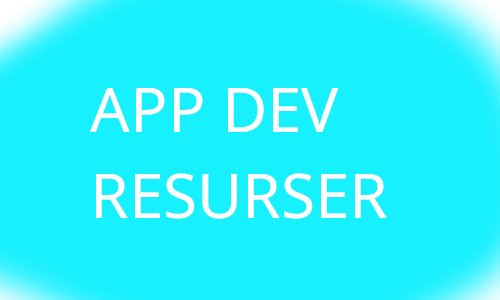

## Vad är det här?

På den här repon finns en massa olika resurser som du kan behöva om du skapar applicationer

## Innehåll

 - [Bilder](#Bilder)
 - [Fonter](#Fonts)
 - [Videos](#Videos)
 - [Ikoner](#Frameworks)
 - [Frameworks](#Frameworks)
 - [Tutorials](#Tutorials)
 - [Extensions](#Extensions)
 - [NodeJS libraries](#NodeJS libraries)

# Bilder

Bilder kan föra dina web appar från tråkiga gråa och vita sidor till lysande och färglada sidor.  
Det här är en lista av både gratis och betalda bild libraries.

### Gratis bilder

| Sida  | Link |
| ------------- | ------------- |
| PixaBay | [LINK](https://pixabay.com/)  |
| UnSplash | [LINK](https://unsplash.com/)  |
| Pexels | [LINK](https://www.pexels.com/)  |
| FreeImages | [LINK](https://www.freeimages.com/)  |

### Betalda bilder

| Sida  | Link |
| ------------- | ------------- |
| ShutterStock | [LINK](https://www.shutterstock.com/images)  |
| iStock | [LINK](https://www.istockphoto.com/)  |
| Adobe Stock | [LINK](https://stock.adobe.com/)  |

# Fonter

Att välja rätt font är svårt, men också väldigt viktigt.  
Det här är en lista av font libraries.

| Sida  | Link |
| ------------- | ------------- |
| Google Fonts | [LINK](https://fonts.google.com/)  |
| DaFont | [LINK](https://www.dafont.com/)  |
| 1001 Fonts | [LINK](https://www.1001fonts.com/)  |
| Adobe Fonts | [LINK](https://fonts.adobe.com/)  |
| MyFonts | [LINK](https://www.myfonts.com/)  |
| Behance | [LINK](https://www.behance.net/search/projects?search=Free%20font)  |

# Videos

Stock video library sidor för dina web appar.

### Gratis

| Sida  | Link |
| ------------- | ------------- |
| Pexels Videos | [LINK](https://www.pexels.com/videos/)  |
| PixaBay Videos | [LINK](https://pixabay.com/videos/)  |
| Videvo | [LINK](https://www.videvo.net/)  |

### Betalda

| Sida  | Link |
| ------------- | ------------- |
| ShutterStock Video | [LINK](https://www.shutterstock.com/video)  |
| VideoHive | [LINK](https://videohive.net/category/stock-footage)  |
| StoryBlocks | [LINK](https://www.storyblocks.com/)  |

# Ikoner

Ikoner är oftast små bilder som kan göra din UI/UX 100 gånger bättre.  
Det här är en lista av Ikon libraries.

| Sida  | Link |
| ------------- | ------------- |
| FlatIcon | [LINK](https://www.flaticon.com/) |
| FontAwesome | [LINK](https://fontawesome.com/icons) |
| Noun Project | [LINK](https://thenounproject.com/) |
| icons8 | [LINK](https://icons8.com/icons) |
| Free Icons | [LINK](https://freeicons.io/) |

# Frameworks

Det finns tusentals frameworks, svårt att välja den rätta just för ditt projekt.

## JavaScript Frameworks
| Framework  | Beskrivning |
| ------------- | ------------- |
| [ReactJS](https://reactjs.org/) | ReactJS är en frontend framework skapad av Meta (Facebook) som gör det väldigt lätt att göra snygga frontends för dina applikationer |
| [VueJS](https://vuejs.org/) | VueJS är en open source frontend framework som använder model–view–viewmodel logik |
| [NextJS](https://nextjs.org/) | NextJS är en frontend framework som är byggd på facebooks ReactJS |

## Python Frameworks

| Framework  | Beskrivning |
| ------------- | ------------- |
| [Django](https://www.djangoproject.com/) | Django är ett Python framework för web developement som kan användas för både front-end och back-end |
| [Flask](https://flask.palletsprojects.com/en/2.0.x/) | Flask är ett Python framework känt för hur de inte använder andra libraries eller packages och kallas ofta ett "Micro framework" |

# Tutorials

Tutorials för att lära sig med.

## ReactJS tutorials

| Tutorial  | Beskrivning |
| ------------- | ------------- |
| [Getting Started!](https://youtu.be/pgAvVxowaYU) | Bra tutorial för nybörjare som vill börja lära sig React |
| [Spotify Clone](https://www.youtube.com/watch?v=pnkuI8KXW_8) | Long ReactJS tutorial där du lär dig hur man skapar en Spotify clone i React |

## NodeJS tutorials

| Tutorial  | Beskrivning |
| ------------- | ------------- |
| [NodeJS for beginners](https://youtu.be/TlB_eWDSMt4) | NodeJS tutorial för nybörjare som vill lära sig Node |
| [Discord Bot](https://youtu.be/BmKXBVdEV0g) | Simpel tutorial där du lär dig hur man skapar en simpel Discord bot med DiscordJS |
| [Firebase authentication](https://youtu.be/kX8by4eCyG4) | Tutorial för authentication med Firebase i Node |

# Browser extensions

Det finns många browser extension som kan hjälpa och försnabba ditt arbete som en web developer.  
Det här är en lista av de jag skulle rekommendera.

| Extension  | Chrome | Firefox | Beskrivning |
| ------------- | ------------- | ------------- | ------------- |
| Ublock Origin | [LINK](https://chrome.google.com/webstore/detail/ublock-origin/cjpalhdlnbpafiamejdnhcphjbkeiagm?hl=en) | [LINK](https://addons.mozilla.org/en-US/firefox/addon/ublock-origin/) | En Adblocker är ett måste om du är på nätet, uBlock origin är den simplaste och bästa |
| Fast Forward | N/A | [LINK](https://addons.mozilla.org/en-US/firefox/addon/fastforwardteam/) | FastForward skippar en massa onödiga ad linkar och tracker linkar och för dig direkt till destinationen |
| Octotree | [LINK](https://chrome.google.com/webstore/detail/octotree-github-code-tree/bkhaagjahfmjljalopjnoealnfndnagc) | [LINK](https://addons.mozilla.org/en-US/firefox/addon/octotree/) | Octotree gör så att du kan lättare gå igenom github repo strukturer |
| WhatRuns | [LINK](https://chrome.google.com/webstore/detail/whatruns/cmkdbmfndkfgebldhnkbfhlneefdaaip?hl=en) | [LINK](https://addons.mozilla.org/en-US/firefox/addon/whatruns/) | WhatRuns visar vad en viss websida kör på |
| ColorZilla | [LINK](https://chrome.google.com/webstore/detail/colorzilla/bhlhnicpbhignbdhedgjhgdocnmhomnp?hl=en) | [LINK](https://addons.mozilla.org/en-US/firefox/addon/colorzilla/) | ColorZilla är en color picker och selector som gör det lätt att hitta färger från sidor |

# NodeJS libraries

Här är några väldigt användbara och bra NPM libraries

| Extension  | Chrome | Firefox | Beskrivning |
| ------------- | ------------- | ------------- | ------------- |
| Ublock Origin |  |  | En Adblocker är ett måste om du är på nätet, uBlock origin är den simplaste och bästa |
